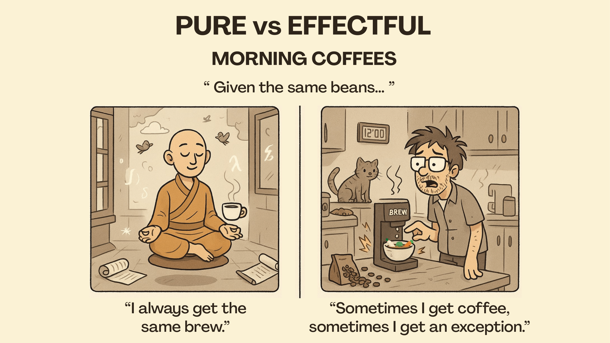

Hi! My name is Miguel Ramos, and I am a PhD student in Computer Science at [DCC@FCUP](https://www.dcc.fc.up.pt/site/) and [IRIF@UParis](https://www.irif.fr/) under the supervision of [Sandra Alves](https://www.dcc.fc.up.pt/~sandra/Home/Home.html) and [Delia Kesner](https://www.irif.fr/~kesner/). And our work mainly focuses on the use of non-idempotent intersection types to build resource aware semantics for computational effects.

Here is my [dblp page](https://dblp.uni-trier.de/pid/82/8172-2.html), and here is some of my work:

## Journal Papers

<!-- ### Submitted/Under Review -->

<!-- ### Published -->

* Computer Science:

  + [Sandra Alves, Delia Kesner, Miguel Ramos: A Quantitative Approach to Global State Composition \[MSCS\]](https://doi.org/10.1017/S0960129525100285)

* Bioinformatics:

  + [Fishing for DNA? Designing baits for population genetics in target enrichment experiments: guidelines, considerations and the new tool supeRbaits \[Molecular Ecology Resources 2022\]](http://dx.doi.org/10.1111/1755-0998.13598)

## Conference Papers

<!-- ### Submitted/Under Review -->

<!-- ### Published -->

* [Sandra Alves, Delia Kesner, Miguel Ramos: Extending the Quantitative Pattern-Matching Paradigm \[APLAS 2024\]](https://link.springer.com/chapter/10.1007/978-981-97-8943-6_5)
* [Sandra Alves, Delia Kesner, Miguel Ramos: Quantitative Global Memory \[WoLLIC 2023\]](https://arxiv.org/pdf/2303.08940.pdf)
* [Sandra Alves, Miguel Ramos: An ML-style record calculus with extensible records \[MFPS 2021\]](https://arxiv.org/abs/2108.06296v2)
* [Sandra Alves, Maribel Fernández, Miguel Ramos: EVL: A Typed Higher-Order Functional Language for Events \[LSFA 2020\]](https://www.sciencedirect.com/science/article/pii/S1571066120300384?via%3Dihub)

## Workshops Papers

* [Miguel Ramos: Non-Idempotent Intersection Types for Global State \[ITRS 2024\]](https://itrs2024.di.unito.it/ITRS24_paper_8.pdf)
* [Miguel Ramos, Riccardo Treglia, Delia Kesner: Quantitative Understanding of Exceptions \[TLLA 2023\]](https://boilnkettle.github.io/assets/papers/quantitative-understanding-of-exceptions.pdf)
* [Sandra Alves, Delia Kesner, Miguel Ramos: Extending the Quantitative Pattern-Matching Paradigm \[LSFA 2021\]](https://lsfa2022.github.io/lsfa2022-preproc.pdf)

## Peer-Reviewing

* Subreviewer at [FSCD 2025](https://fscd2025.github.io/cfp.htm)
* Subreviewer at [CSL 2025](https://csl2025.github.io/)
* Subreviewer at [PPDP 2024](https://ppdp2024.github.io/)
* Subreviewer at [MFPS 2022](https://www.cs.cornell.edu/mfps-2022/)

## Presentations

* [Extending the Quantitative Pattern-Matching Paradigm \[APLAS 2024\]](https://boilnkettle.github.io/assets/presentations/aplas24.pdf)
* [Quantitative Global Memory \[WoLLIC 2023\]](https://boilnkettle.github.io/assets/presentations/wollic23.pdf)
* [A Quantitative Understanding of Exceptions \[TLLA 2023\]](https://boilnkettle.github.io/assets/presentations/tlla23.pdf)
* [Quantitative CBV Global Memory \[SMS@IRIF 2023\]](https://boilnkettle.github.io/assets/presentations/sms23.pdf)

## MSc Thesis

* [Supervised by Sandra Alves: Typed Languages for Events and their Applications \[FCUP 2021\]](https://sigarra.up.pt/fcup/pt/pub_geral.show_file?pi_doc_id=311049)

Lately, I've also been working as a teaching assistant at [FCUP](https://www.fc.up.pt/site/) and [FEUP](https://www.fe.up.pt/site).

## Teaching

* Theory of Computation

  + [2nd Semester 2024/2025](https://sigarra.up.pt/feup/pt/ucurr_geral.ficha_uc_view?pv_ocorrencia_id=541875)
  + [2nd Semester 2021/2022](https://sigarra.up.pt/feup/en/UCURR_GERAL.FICHA_UC_VIEW?pv_ocorrencia_id=484423)

* Discrete Mathematics
  + [1st Semester 2025/2026](https://sigarra.up.pt/feup/pt/ucurr_geral.ficha_uc_view?pv_ocorrencia_id=560089)
  + [1st Semester 2024/2025](https://sigarra.up.pt/feup/pt/ucurr_geral.ficha_uc_view?pv_ocorrencia_id=541869)
  + [1st Semester 2022/2023](https://sigarra.up.pt/feup/en/UCURR_GERAL.FICHA_UC_VIEW?pv_ocorrencia_id=501666)
